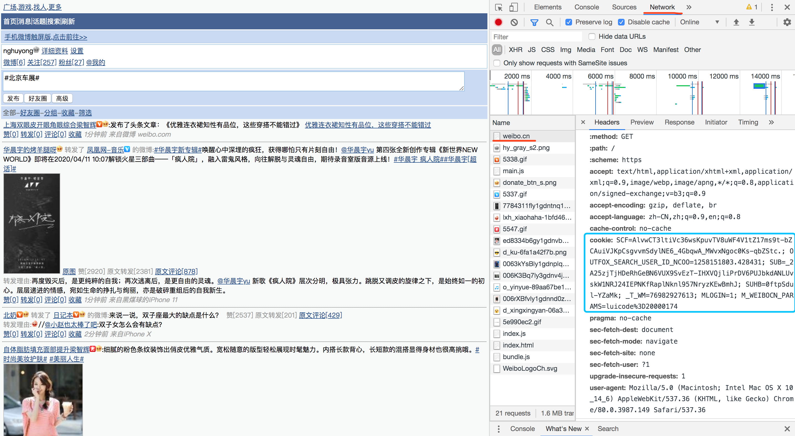
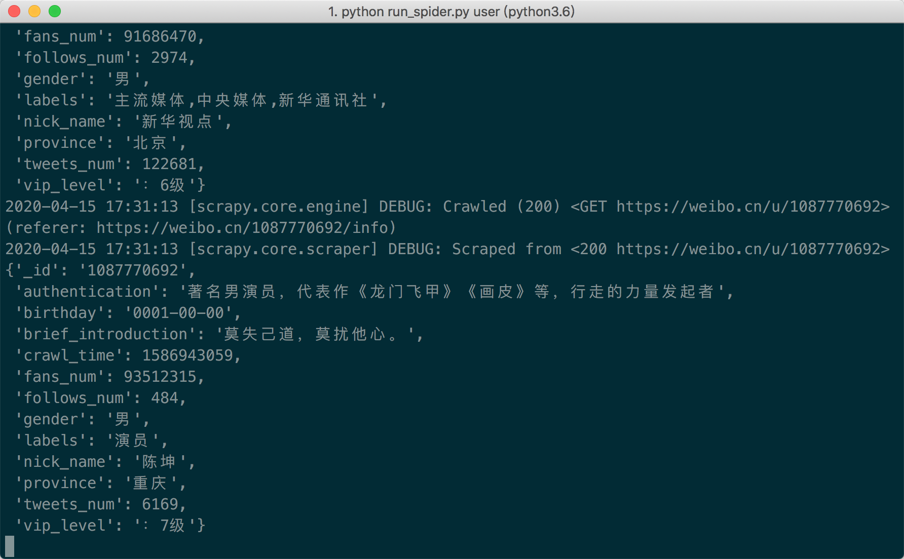
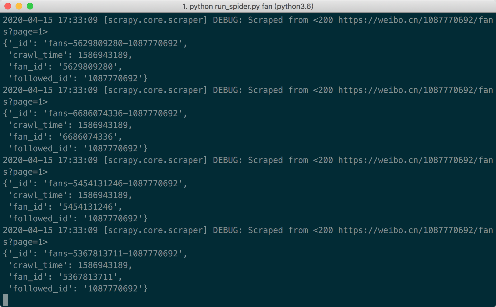
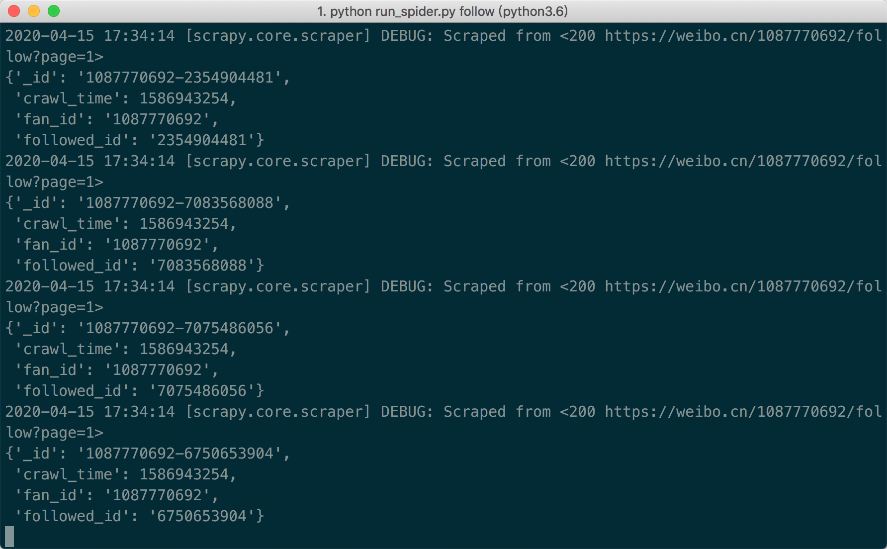
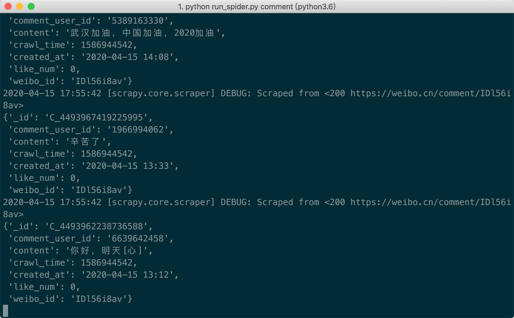
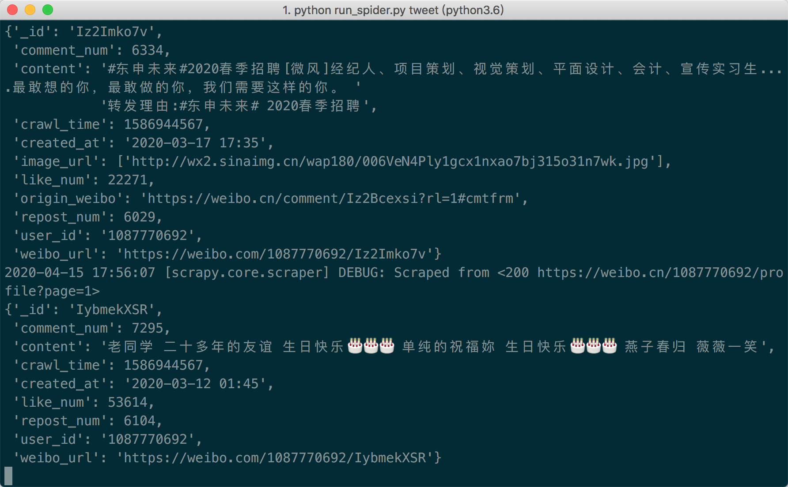
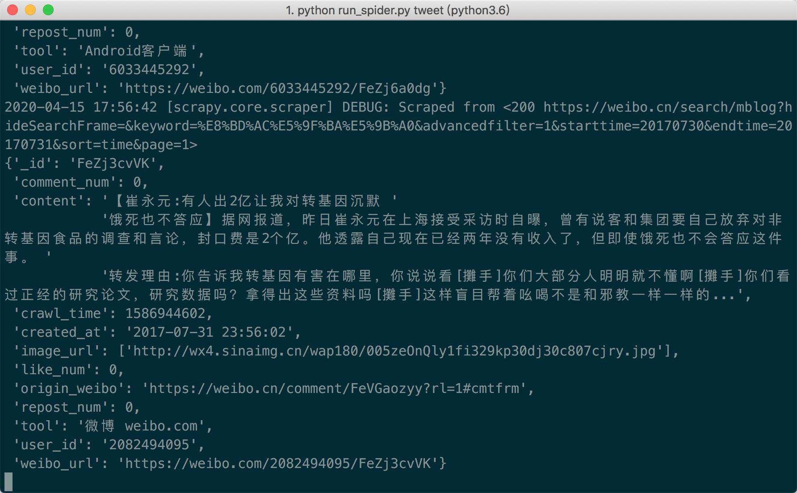
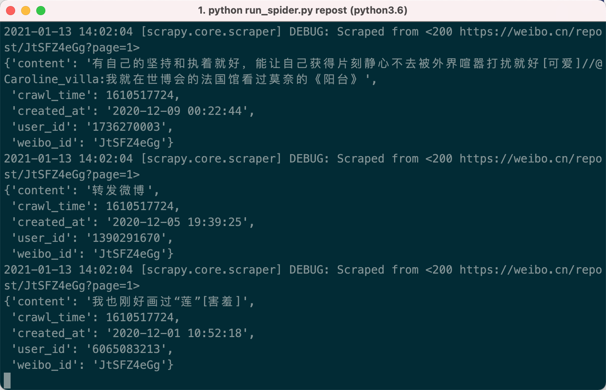

# WeiboSpider

**基于nghuyong/WeiboSpiderde改造**


## 项目说明

### 支持爬虫
- 用户信息抓取
- 用户微博抓取
- 用户社交关系抓取(粉丝/关注)
- 微博评论抓取
- 基于关键词和时间段(粒度到小时)的微博抓取
- 微博转发抓取

### 微博数据字段

#### 用户数据
|    字段   | 说明 |
| :---: | :----: |
|_id       | 用户的ID，可以作为用户的唯一标识 |
|nick_name|昵称|
|gender|性别|
|province | 所在省|
|city |所在市|
|brief_introduction|个人简介|
|birthday |生日|
|tweets_num | 微博发表数|
|fans_num| 粉丝数|
|followers_num|关注数|
|sex_orientation|性取向|
|sentiment|感情状况|
|vip_level| 会员等级|
|authentication|认证情况|
|person_url|用户首页链接|
|labels|用户标签，用逗号分割|
|crawl_time|抓取时间戳|


#### 微博数据
|    字段   | 说明 |
| :---: | :----: |
| _id | 微博id |
|user_id| 这则微博作者的ID |
|content |微博的内容|
|created_at |微博发表时间|
|repost_num |转发数|
|comment_num |评论数|
|like_num| 点赞数|
|tool|发布微博的工具|
|location_map_info|定位的经纬度信息|
|origin_weibo|原始微博，只有转发的微博才有这个字段|
|crawl_time|抓取时间戳|

#### 用户关系数据
|    字段   | 说明 |
| :---: | :----: |
| _id | 用户关系id |
|fan_id| 关注者的用户ID |
|follower_id|被关注者的用户ID|
|crawl_time|抓取时间戳|

#### 评论数据
|    字段   | 说明 |
| :---: | :----: |
| _id | 评论的id |
|comment_user_id|评论的用户ID|
|weibo_id|weibo的ID|
|content|评论内容|
|created_at| 评论创建时间|
|crawl_time|抓取时间戳|


#### 转发数据

|    字段    |      说明       |
| :--------: | :-------------: |
|    _id     |      null       |
| crawl_time |   抓取时间戳    |
|  weibo_id  | 被转发weibo的ID |
|  user_id   |  转发用户的ID   |
|  content   | 转发的评论内容  |
| created_at |    转发时间     |

## 如何使用

### 拉取项目 && 安装依赖
本项目Python版本为Python3.6
```
pip install -r requirements.txt
```

### 替换Cookie
访问https://weibo.cn/

登陆账号，打开浏览器的开发者模式，再次刷新



复制s.weibo.com这个数据包，network中的cookie值以及下方的user-agent

将`weibospider/settings.py`中:
```python
DEFAULT_REQUEST_HEADERS = {
    'User-Agent': 'Mozilla/5.0 (Macintosh; Intel Mac OS X 10.13; rv:61.0) Gecko/20100101 Firefox/61.0',
    'Cookie':'SCF=AlvwCT3ltiVc36wsKpuvTV8uWF4V1tZ17ms9t-bZCAuiVJKpCsgvvmSdylNE6_4GbqwA_MWvxNgoc0Ks-qbZStc.; OUTFOX_SEARCH_USER_ID_NCOO=1258151803.428431; SUB=_2A25zjTjHDeRhGeBN6VUX9SvEzT-IHXVQjliPrDV6PUJbkdANLUvskW1NRJ24IEPNKfRaplNknl957NryzKEwBmhJ; SUHB=0ftpSdul-YZaMk; _T_WM=76982927613'
}
```
Cookie和user-agent字段替换成自己的

**如果爬虫运行出现403/302，说明账号被封/cookie失效，请重新替换cookie**


**Tips:**

通过关键词爬取微博由于weibo.cn中取消了这个功能，在对应的tweet.py中做了修改，因而需要在weibo.com和weibo.cn都登陆过，再获取cookie写入

## 运行程序
在/weibospider/目录下的各txt文件修改对应的weibo_id/user_id

### 抓取用户信息

```
cd weibospider
# 完整版
python run_spider.py user

# 简要版
python run_spider.py user_brief
```


### 抓取用户粉丝列表
```bash
python run_spider.py fan
```



### 抓取用户关注列表
```bash
python run_spider.py follow
```


### 抓取微博评论
将需要获取评论的微博id存储在comment_tweet_ids.txt中
```bash
python run_spider.py comment
```

具体需要爬取的微博id在/weibospider/tweet_ids.txt中进行添加

### 抓取用户的微博
在`./weibospider/spiders/tweet.py`中`start_requests`,urls选择`init_url_by_user_id()`
```bash
python run_spider.py tweet
```



### 抓取包含关键词的微博
在`./weibospider/spiders/tweet.py`中`start_requests`,urls选择`init_url_by_keywords()`
- 可以在TWEET_DATE_WINDOW中修改爬取的时间窗口
- 在MAX_DELTA中修改最大时间间隔（一次搜索的最大间隔，如果内容超过50页，会动态缩小区间），
- 通过修改ONLY_HOT, ONLY_ORIGIN的值，限制只爬取热门微博/原创微博（不能同时限制）
```bash
python run_spider.py tweet
```

修改爬取时间和关键词在/weibospider/settings.py中修改TWEET_DATE_WINDOW, TWEET_KEY_WORDS两个参数的值即可


### 抓取微博转发

```bash
python run_spider.py repost
```


